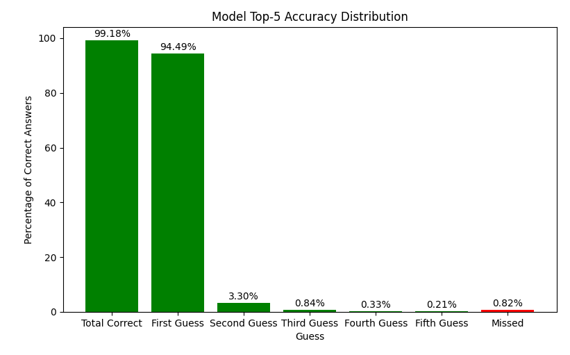

# DeliciousAI_Hackathon
March 2024 Artificial Intelligence Association hackathon competition. (Group: Daniel Stapley, Kai Sandberg, Aaron Earl, Collin McGregor, Jonathan Utley)

# Table of Contents
- [Introduction and Background](#project-background)
- [Process and Implementation](#processimplementation---danny)
- [Results](#results)
- [Rank](#rank)

## Project Background

### What Delicious AI Does
- **Image Classification** - They use "computer vision, 3D point clouds, and sophisticated machine learning models to capture better data and deliver better intelligence in milliseconds." 
- **Who Uses Their Services** - Their principal goal is to help retailers use artificial intelligence to know when they need to restock. They assist in the optimization of these processes in order to maximize efficiency.

### The Problem
- **Limited Data** - Delicious AI has recruited the help of the BYU AI Association to classify images into a large number of classes. Comparative to the amount of classes, the dataset is relatively small, and therefore more difficult to classisfy with reliable accuracy.

## Project Objective
- **Sort Data** - The main goal of this project is to sort the provided dataset of images into classes with the highest degree of accuracy possible. Assign each classificaton a number between 1 and 5, denoting predicted degree of accuracy. 
- **Using** - Prioritizing accuracy above all else, we will use pre-trained machine learning models found in TorchVision library of PyTorch.

## General Project Plan
- **Prepare Data** - Organize our dataset into proper folders (train, validation, test), use 'torchvision.transforms' function within the PyTorch library to normalize images. Create a PyTorch DataLoader for each set
- **Prepare EfficientNet** - Load the pre-trained EfficientNet model from torchvision

```python
import torch
import torchvision.transforms as transforms
from torchvision.models import efficientnet_b0
from torch.utils.data import DataLoader, random_split

model = efficientnet_b0(pretrained=True)
```

- **Modify Output Layer** - Modify the output layer to match the number of classes in the dataset

```python
num_classes = pass
model.fc = torch.nn.Linear(model._fc.in_features, num_classes)
```

- **Define Loss Function and Optimizer** - Define functions to help train our model on our dataset

```python
criterion = torch.nn.CrossEntropyLoss()
Optimizer = torch.optim.Adam(model.parameters(), lr=0.001)
```

- **Train Our Model**
```python
num_epochs = 10
for epoch in range(num_epochs):
  for inputs, labels in train_loader:
    optimizer.zero_grad()
    outputs = model(inputs)
    loss = criterion(outputs, labels)
    loss.backward()
    optimizer.step()
```

- **Evaluate Performance** - After training, evaluate the model's performance with the validation set

```python
model.eval()
with torch.no_grad():
  for inputs, labels in val_loader:
    outputs = model(inputs)
```
- **Test the Model** - Finally, test the trained model on our test set and see how well it generalizes/classifies

```python
model.eval()
with torch.no_grad():
  for inputs, labels in test_loader:
    outputs = model(inputs)
```

- **Adjust Hyperparameters** - If necessary, try adjusting hyperparameters (like learning rate, batch size) and consider data augmentation techniques to improve performance


# Process/Implementation - Danny
Everything not included or explained in the above project plan, I will explain in detail in this section. As with any project, I stuck to the plan and made adjustments along the way.

- **Prepare The Data** - To start, I had to define a function that would normalize the sizes of all of the images. I decided to make the images 224x224. I also had to load the classes from the provided names.yaml file.
```python
# Define transformations
transform = transforms.Compose([
    transforms.Resize((224, 224)),
    transforms.ToTensor(),
    transforms.Normalize((0.5, 0.5, 0.5), (0.5, 0.5, 0.5))
])

def load_class_mapping(yaml_file):
    with open(yaml_file, 'r') as file:
        yaml_content = yaml.safe_load(file)
    return {str(cls): idx for idx, cls in enumerate(yaml_content['classes'])}

class_yaml=os.path.expanduser('~/downloads/bev_classification/names.yaml')

def invert_mapping(mapping):
    return {v: k for k, v in mapping.items()}

class_mapping = load_class_mapping(class_yaml)
index_to_class = invert_mapping(class_mapping)
```

- **Create Custom Datasets** - Inheriting from the Dataset class in the PyTorch library, I made two subclasses: CustomTrainDataset and CustomTestDataset. I did this because we were going to be treating our training and testing datasets differently. Furthermore, the training data was given in a text file as paths to each image from the `/images` directory, followed by its associated class. The testing data was just a path to each image.
```python
# Custom dataset for training
class CustomTrainDataset(Dataset):
    def __init__(self, annotations_file, img_dir, class_yaml, transform=None):
        self.img_labels = [line.strip().split(',') for line in open(annotations_file)]
        self.img_dir = img_dir
        self.transform = transform
        self.label_to_index = load_class_mapping(class_yaml) 

    def __len__(self):
        return len(self.img_labels)

    def __getitem__(self, idx):
        img_path, label_str = self.img_labels[idx]
        img_path = os.path.join(self.img_dir, img_path)
        image = Image.open(img_path).convert('RGB')
        label = self.label_to_index[label_str]
        if self.transform:
            image = self.transform(image)
        return image, label

# Custom dataset for testing
class CustomTestDataset(Dataset):
    def __init__(self, annotations_file, img_dir, transform=None):
        self.img_paths = [line.strip() for line in open(annotations_file)]
        self.img_dir = img_dir
        self.transform = transform

    def __len__(self):
        return len(self.img_paths)

    def __getitem__(self, idx):
        img_path = os.path.join(self.img_dir, self.img_paths[idx])
        image = Image.open(img_path).convert('RGB')
        if self.transform:
            image = self.transform(image)
        return image, self.img_paths[idx] 
```

- **Initialize Necessary Variables** - Once I loaded in the datasets, it was time to load in the CNN model and make other miscellaneous preparations. I ended up sticking with `EfficientNet_B0`, as planned. The default number of classes in EfficientNet's classifier is 1000, and we only had 99, so I manually set `num_classes` to 99. Then, I added a couple lines that would move the model to run on the GPU if a `cuda` compatible GPU was available. I added this later after having trouble training the model on my laptop. Using the GPU in my desktop was approximately 5x faster than my local CPU. Lastly, I defined the loss and optimizer funcions, with a standard learning rate `lr` of 0.001.
```python
# Initialize the model
model = models.efficientnet_b0(weights=EfficientNet_B0_Weights.DEFAULT)

# Update the number of classes in the classifier
num_classes = 99
model.classifier[1] = nn.Linear(model.classifier[1].in_features, num_classes)

# Move model to GPU if available
device = torch.device("cuda:0" if torch.cuda.is_available() else "cpu")
model.to(device)

# Loss and optimizer
criterion = nn.CrossEntropyLoss()
optimizer = optim.Adam(model.parameters(), lr=0.001)
```

- **Save Functionality** - After experiencing an unexpected interruption to the program halfway through training, I took the time to add a save function. If the training process was interrupted, the model's progress (current epoch, the model's state, and the optimizer's state) would be preserved in a large binary file called `model_checkpoint.pth`. This code configures the program to run from a saved state, if there is one avaliable. Else, it will start from scratch. 
```python
# Define the checkpoint file path
checkpoint_dir = os.getcwd()
checkpoint_path = os.path.join(checkpoint_dir, 'model_checkpoint.pth')

# Load saved checkpoints
if os.path.exists(checkpoint_path):
    checkpoint = torch.load(checkpoint_path)
    model.load_state_dict(checkpoint['model_state_dict'])
    optimizer.load_state_dict(checkpoint['optimizer_state_dict'])
    start_epoch = checkpoint['epoch'] + 1
else:
    start_epoch = 0
```

- **Run The Training Loop** - At this point, the model has everything it needs to begin learning on the training dataset. This loop goes through all of the 88,794 images ten times. Each loop, running loss got smaller, indicating that the model was learning. I chose 10 epochs, a relatively standard choice, to try and maximize accuracy without overfitting. At the end of each loop, progress is saved. With limited computing resources, training took approximately 10 hours. 
```python
# Training loop
num_epochs = 10
for epoch in range(start_epoch, num_epochs):
    model.train()
    running_loss = 0.0
    for inputs, labels in train_loader:
        inputs, labels = inputs.to(device), labels.to(device)

        optimizer.zero_grad()
        outputs = model(inputs)
        loss = criterion(outputs, labels)
        loss.backward()
        optimizer.step()
        running_loss += loss.item()

    print(f'Epoch {epoch+1}, Loss: {running_loss/len(train_loader)}')
    torch.save({
    'epoch': epoch,
    'model_state_dict': model.state_dict(),
    'optimizer_state_dict': optimizer.state_dict(),
    }, checkpoint_path)
```

- **Test The Trained Model** - After the model was trained, it was time to test it out on the testing dataset. I used the `torch.no_grad()` method because I didn't want the model to continually adjust the weights and run the risk of overfitting. This code snippet outputs the model's class predictions for each image in top-1 and top-5 scoring format in their own respective text files, per competition instructions. 
```python
with torch.no_grad():
    for images, paths in test_loader:
        images = images.to(device)
        outputs = model(images)

        _, top1_pred = outputs.topk(1, 1, True, True)
        _, top5_pred = outputs.topk(5, 1, True, True)
        
        top1_pred = top1_pred.squeeze().tolist()
        top5_pred = top5_pred.tolist()
        
        for i, path in enumerate(paths):
        # Convert top-1 and top-5 indices to class names
            top1_class_name = index_to_class[top1_pred[i] if type(top1_pred) is list else top1_pred]
            top5_class_names = [index_to_class[idx] for idx in top5_pred[i]]
        
            predictions.append((path, top1_class_name, *top5_class_names))

# Save the top-1 predictions with class names
with open('formatted_top1_predictions.txt', 'w') as f:
    for path, top1_class_name, *_ in predictions:
        f.write(f'{path}, {top1_class_name}\n')

# Save the top-5 predictions with class names
with open('formatted_top5_predictions.txt', 'w') as f:
    for path, _, *top5_class_names in predictions:
        f.write(f'{path}, ' + ', '.join(top5_class_names) + '\n')
```

# Results

### Top-1 Scoring
Computing the accuracy with `compute_accuracy.py`, as outputted in `Top1_Result.txt`:

"Out of 9898 images, the correct class was predicted with 94.4938% accuracy"

### Top-5 Scoring
Computing the accuracy with `compute_accuracy.py`, as outputted in `Top5_Result.txt`:

"Out of 9898 images, 9817 (99.18%) images' classes were predicted accurately within 5 guesses. Out of all 9898:
94.49% were predicted on the first try.
3.30% were predicted on the second try.
0.84% were predicted on the third try.
0.33% were predicted on the fourth try.
0.21% were predicted on the fifth try.
0.82% were missed."

Visualization of above data, generated using `matplotlib` in `compute_accuracy.py`



### Rank
Achieved the highest degree of accuracy at 94.49% for top 1 scoring, a full 10% higher than the next team at 84% accuracy. Achieved a notable accuracy of over 99% for top 5 scoring.